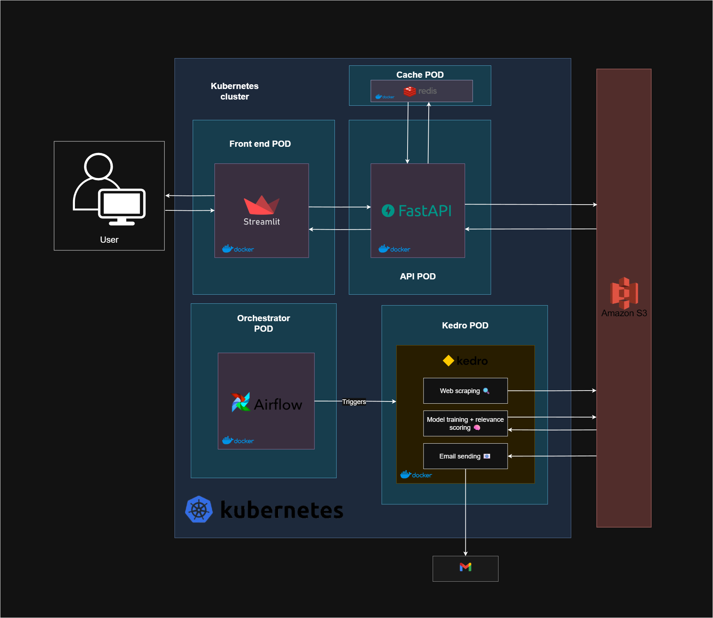

# Job Finder

**Ever spent hours scrolling through job boards, jumping from site to site, only to find the same irrelevant listings—or worse, miss the good ones entirely?**

This project was born out of that exact pain. Job hunting shouldn't be tedious or chaotic.

**Job Finder** centralizes job offers from multiple sources and provides powerful features to make your job search smarter and more efficient:

- **Centralized Job Discovery**: Aggregates job offers from various platforms into a single, unified interface. No more jumping from site to site—everything is in one place, sorted by relevance and ready for feedback.
- **CV Matching**: Instantly match your CV to the most relevant job offers. Just drag and drop your CV into the app, and get personalized recommendations based on semantic similarity. See how it works:

  

- **Daily Briefing & Feedback**: Receive daily personalized job recommendations by email, and provide feedback directly in the app to improve future suggestions.
- **Machine Learning Ranking**: The app can use your feedback to train a machine learning model that ranks jobs by relevance.

Below is a screenshot of the main interface with all job offers that can be sorted by relevance:

  

## Technology Stack

- **Python 3.8+**
- **Kedro**: reproducible and modular data pipelines
- **Pandas, NumPy**: data manipulation and processing
- **scikit-learn**: machine learning (SGDClassifier, TF-IDF vectorization)
- **FastAPI**: backend API for job offers, relevance scores, and feedback
- **Frontend**: custom web app
- **Azure**: deployment (AKS) and storage for scraped data, models, and results
- **Email service**: daily summaries (SMTP or any email API)
- **Docker**: containerized deployment
- **GitHub Actions**: CI/CD for testing, building, and deploying Docker containers
- **Redis**: in-memory key-value store for caching and fast data access
- **Kubernetes**: scalable deployment and job orchestration
- **Terraform**: infrastructure as code for cloud resources (the ChromaDB vector database set on an Azure VM)
- **ChromaDB**:

  

## Kedro Pipelines: Automated Data & ML Workflow

The project relies on a robust Kedro pipeline that orchestrates the entire data and ML workflow, running on a schedule (via Airflow or cron):

1. **Web Scraping**: A Kedro node scrapes job offers from multiple sources/platforms.

2. **Preprocessing**: Each job offer is cleaned and normalized. For example, a raw job description like:

  > "We are looking for a Senior Python Developer to join our dynamic team!\n\nRequired skills:\n- Python\n- Django\n- Teamwork\n- Good communication\n\nPosition based in Paris, remote work possible."

  becomes after preprocessing:

  > "python developer senior looking join dynamic team required skills python django teamwork communication position paris remote"

  (Lowercased, stopwords removed, accents removed if any, skills normalized, etc.)

3. **Vectorization**: The cleaned offers are embedded as vectors and stored in a ChromaDB vector database (hosted on Azure VM).
4. **Feedback Aggregation**: The pipeline collects historical user feedback (likes/dislikes) from the app.
5. **ML Training**: (Optional) The feedback is used to train a machine learning model to rank job offers by relevance.
6. **Email Notification**: At the end of the pipeline, a personalized email is sent to the user with the top job recommendations for the day.

This automated pipeline ensures that the data is always fresh, the recommendations are up-to-date, and the system can continuously learn from user feedback.

## Contributing

Want to contribute to this project? Please read our [CONTRIBUTING.md](CONTRIBUTING.md) for guidelines on how to get started, coding standards, and the development workflow.

## Modern Python Tooling

This project uses a modern Python development workflow to ensure code quality, maintainability, and type safety:

- **mypy**: static type checking for Python
- **pre-commit**: automated code quality checks before every commit
- **ruff**: fast Python linter and code style enforcement
- **black**: uncompromising code formatter
- **isort**: import sorting
- **pytest**: comprehensive test suite

All code is checked automatically on every commit and pull request, ensuring a robust and maintainable codebase.

## Secrets Management

In a typical Kedro setup, secrets are managed by placing credential files inside the `conf/`
directory, excluding them via `.gitignore`, and injecting them through GitHub Actions using
GitHub Secrets. This allows the secret YAML files to be recreated at build time before pushing
to Docker Hub. This approach is suitable for **private images**, as credentials can safely be embedded
inside the Docker image.

However, since my Docker image is **public**, I avoid embedding any secrets directly in the image.
Instead, I prefer using **environment variables** to handle credentials securely, depending on the
environment (e.g., local, Kubernetes, or CI/CD pipelines).
